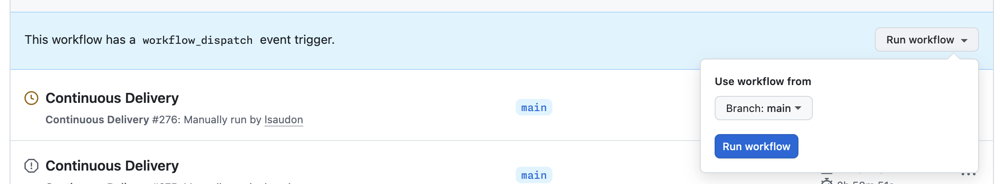
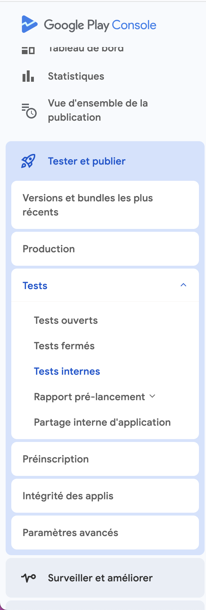

# Release

## Setup

- [Android](android/build.md)
- [iOS](ios/build.md)

## Publier une nouvelle version sur les stores iOS et Android

### 1. Préparer la version

1. Créer une branche `chore/release-X.X.X` (remplacer X.X.X par le numéro de version)
1. Mettre à jour la version dans le fichier [app/pubspec.yaml](../app/pubspec.yaml)

   Laisser le +0, il sera modifié automatiquement avec le numéro de l'action GitHub.

   ```yaml
   name: app
   description: "J’agis vous accompagne à chaque étape de la transition écologique."
   publish_to: "none"
   version: X.X.X+0 <----- Modifier ici

   environment:
     sdk: 3.8.1
     flutter: 3.32.6
   ```

1. Committer avec le message `chore: release X.X.X`
1. Fusionner sur main

### 2. Lancer le processus de build

1. Aller sur la [page Continuous Delivery](https://github.com/betagouv/jagis-mobile/actions/workflows/continuous-delivery.yml)
1. Cliquer sur `Run workflow` puis sur `Run workflow`

   

   L'action va créer les versions iOS et Android pour l'environnement Dev, puis attendre une validation manuelle pour la version Prod.

1. Valider la version de dev : cliquer sur `Review deployments`, cocher `production` puis `Approve and deploy`

### 3. Publier sur Google Play Store (Android)

1. Télécharger l'artéfact généré par l'action GitHub
1. Aller sur [Google Play Console](https://play.google.com/console/u/1/developers/9006095743383319605/app-list)
1. Sélectionner l'application `J’agis - Dev` ou `J’agis`
1. Naviguer vers `Tester et publier > Tests > Tests internes`
  
   

1. Cliquer sur `Créer une version`
1. Extraire l'artéfact téléchargé, cliquer sur `Importer` et choisir le fichier `app-development-release.aab` ou `app-production-release.aab`
1. Cliquer sur `Suivant` puis sur `Enregistrer et publier`
1. Sur la page Tests internes, cliquer sur `Promouvoir la release` puis `Production`
1. Cliquer sur `Suivant`, `Enregistrer`, `Accéder à l'aperçu`
1. Confirmer avec `Envoyer 1 modification pour examen ?` puis `Envoi des modifications pour examen`

### 4. Publier sur App Store (iOS)

1. Aller sur [App Store Connect](https://appstoreconnect.apple.com/)
1. Sélectionner l'application J’agis
1. Aller dans l'onglet `Apps` puis sélectionner l'app J’agis
1. Cliquer sur `App iOS +` en haut à gauche
1. Saisir le numéro de version (X.X.X)
1. Appuyer sur `Créer`
1. Remplir la section Nouveautés de cette version (ex: Correction de bugs mineurs et amélioration des performances)
1. Dans la section `Build`, cliquer sur `Ajouter un build` et sélectionner le build correspondant
1. Cliquer sur `Enregistrer` puis `Ajouter pour vérification`
1. Une fois approuvé par Apple, cliquer sur `Soumettre à l'équipe de vérifications des apps`

### Notes importantes

- Les versions de développement doivent être testées avant la publication en production
- Les délais d'approbation peuvent varier : quelques heures pour Google Play, 24-48h pour l'App Store
- Vérifier que toutes les métadonnées (description, captures d'écran, etc.) sont à jour avant la publication
